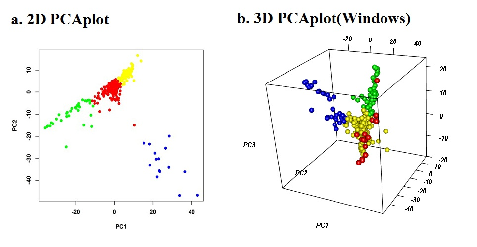

# MVP [](https://github.com/XiaoleiLiuBio/MVP/issues) [](https://github.com/XiaoleiLiuBio/MVP/commits/master)

## A Memory-efficient, Visualization-enhanced, and Parallel-accelerated Tool For Genome-Wide Association Study

<p align="center">
<a href="https://raw.githubusercontent.com/XiaoleiLiuBio/MVP/master/results/mvp_logo.png">

</a>
</p>

### Authors:

> Lilin Yin, Haohao Zhang, Zhiwu Zhang, Xinyun Li, Xiaohui Yuan, Shuhong Zhao, ***Xiaolei Liu***

### Contact:
> [xiaoleiliu@mail.hzau.edu.cn](Xiaolei Liu)

### Contents
<!-- TOC updateOnSave:false -->

- [Installation](#installation)
- [Data Preparation](#data-preparation)
    - [Phenotype](#Phenotype)
    - [PLINK binary](#plink-binary)/[VCF](#vcf)/[Hapmap](#hapmap)/[Numeric](#numeric)
    - [Kinship](#kinship)/[Principal Components](#principal-components)
- [Data Input](#data-input)
    - [Basic](#basic)
    - [Advanced](#advanced)
- [Start GWAS](#start-gwas)
- [Output](#output)
    - [Phenotype distribution](#phenotype-distribution)
    - [SNP-density plot](#snp-density-plot)
    - [PCA plot](#pca-plot)
    - [Manhattan plot in Circular fashion](#Manhattan-plot-in-Circular-fashion)
    - [Manhattan plot in Rectangular fashion for single trait/method](#Manhattan plot in Rectangular fashion for single trait/method)
    - [Manhattan plot in Rectangular fashion for multiple traits/methods](#Manhattan plot in Rectangular fashion for multiple traits/methods)
    - [Q-Q plot for single trait/method](#Q-Q plot for single trait/method)
    - [Q-Q plot for multiple traits/methods](#Q-Q plot for multiple traits/methods)    
        - [Single track Q-Q plot](#single-track-q-q-plot)
        - [Multiple track Q-Q plot](#multiple-track-q-q-plot)
- [FAQ and Hints](#faq-and-hints)

<!-- /TOC -->

---
# Installation

**WE STRONGLY RECOMMEND INSTALL MVP ON Microsoft R Open (https://mran.microsoft.com/download/)**  

**MVP** can be installed on Windows and Linux/Mac with following steps, respectively:

***For Windows:***

MVP can be installed with following R codes:  
```r
#if "devtools" isn't installed, please "install.packages('devtools')" first.
> devtools::install_version('RcppEigen', version = "0.3.2.9.0")
> devtools::install_github("Bioconductor-mirror/snpStats")
> devtools::install_github("jaredhuling/rfunctions")
> devtools::install_github("xiaoleiLiubio/MVP")
```

***For Linux/Mac:***
```bash
$ wget https://raw.githubusercontent.com/XiaoleiLiuBio/MVP/master/packages.zip
$ unzip packages.zip
$ cd packages
$ R
> source("MVPinstall.r")
```

After installed successfully, **MVP** can be loaded by typing
```r
> library(MVP)
```
Typing ```?MVP``` could get the details of all parameters.

---

# Data Preparation

## Phenotype

| Taxa | trait1 | trait2 | trait3 |
| :---: | :---: |:---: |:---: |
|33-16|101.5|0.25|0|
|38-11|	102.7|0.23|1|
|4226	|101.2|-0.17|1|
|4722|	105.5|-0.24|0|
|A188	|108.1|0.57|1|
|A214N|	95.13|0.87|0|
|A239	|100.2|-0.16|1|


## PLINK binary
If you have genotype data in **PLINK Binary** format (details see http://zzz.bwh.harvard.edu/plink/data.shtml#bed):  

**fileBed**, name of genotype data in PLINK Binary format  
**fileKin**, TRUE or FALSE, if TRUE, kinship matrix represents relationship among individuals will be calculated  
**filePC**, TRUE or FALSE, if TRUE, principal component analysis will be performed  
**out**, prefix of output file  
**priority**, "speed" or "memory", the "speed" mode is faster but uses more memory while "memory" is slower but uses less memory  
**maxLine**, number, if **priority = "memory"**, it is the number of markers read into memory  
```r
MVP.Data(fileBed="plink",
         filePhe=NULL,
         fileKin=FALSE,
         filePC=FALSE,
         out="mvp.plink",         
         #priority="memory",
         #maxLine=10000,
         )
```

## VCF
If you have genotype data in **VCF** format:  
**fileVCF**, name of genotype data in VCF format  
**filePhe**, name of phenotype data  
**vcf.jump**, number of annotation (Header) rows in VCF file  
**sep.vcf**, seperator of vcf file  
**sep.phe**, seperator of phenotype file  
**fileKin**, TRUE or FALSE, if TRUE, kinship matrix represents relationship among individuals will be calculated  
**filePC**, TRUE or FALSE, if TRUE, principal component analysis will be performed  
**out**, the prefix of output file  
**maxLine**, number, if **priority = "memory"**, it is the number of markers read into memory  

```
##fileformat=VCFv4.2
##fileDate=20171105
##source=PLINKv1.90
##contig=<ID=1,length=2>
##INFO=<ID=PR,Number=0,Type=Flag,Description="Provisional reference allele, may not be based on real reference genome">
##FORMAT=<ID=GT,Number=1,Type=String,Description="Genotype">
#CHROM	POS	ID	REF	ALT	QUAL	FILTER	INFO	FORMAT	-9_CZTB0004	-9_CZTB0006	-9_CZTB0008	-9_CZTB0010	-9_CZTB0011	-9_CZTB0012
1	1	10000235	A	C	.	.	PR	GT	0/1	0/0	0/0	0/0	0/0	0/1
1	1	10000345	A	G	.	.	PR	GT	0/0	0/0	0/0	0/0	1/1	1/1
1	1	10004575	G	.	.	.	PR	GT	0/0	0/0	0/0	0/0	0/0	0/0
1	1	10006974	C	T	.	.	PR	GT	0/0	0/0	0/1	1/1	0/1	1/1
1	1	10006986	A	G	.	.	PR	GT	0/0	0/0	0/1	./.	1/1	1/1
```

```r
MVP.Data(fileVCF="myVCF.vcf",
         #filePhe="Phenotype.txt",
         vcf.jump=6,
         sep.vcf="\t",
         #sep.phe="\t",
         fileKin=FALSE,
         filePC=FALSE,
         out="mvp.vcf",
         #maxLine=10000
         )
```

## Hapmap
If you have genotype data in **Hapmap** format:  

**fileHMP**, a string or a string vector, e.g. fileHMP = "hapmap.txt" or fileHMP = c("chr1.hmp.txt", "chr2.hmp.txt", "chr3.hmp.txt")  
**filePhe**, name of phenotype file  
**sep.hmp**, seperator of hapmap file  
**sep.phe**, seperator of phenotype file  
**SNP.effect**, "Add" or "Dom"  
**fileKin**, TRUE or FALSE, if TRUE, kinship matrix represents relationship among individuals will be calculated  
**filePC**, TRUE or FALSE, if TRUE, principal component analysis will be performed  
**out**, the prefix of output file  
**priority**, "speed" or "memory", the 'speed' mode is faster but uses more memory while 'memory' is slower but uses less memory  
**maxLine**, number, if **priority = "memory"**, it is the number of markers read into memory  

> `hapmap.txt`

| rs# | alleles | chrom | pos | strand | assembly# | center | protLSID | assayLSID | panelLSID | QCcode | 33-16 | 38-11 | 4226 | 4722 | A188 | ... | A239 |
| :---: | :---: |  :---: |  :---: |  :---: | :---: | :---: | :---: | :---: | :---: | :---: | :---: | :---: | :---: | :---: | :---: | :---: | :---: |
| rs3683945 | G/A | 1 | 3197400 | + | NA | NA | NA | NA | NA | NA | AG | AG | GG | AG | GG | ... | AA |
| rs3707673 | A/G | 1 | 3407393 | + | NA | NA | NA | NA | NA | NA | GA | GA | AA | GA | AA | ... | GG |
| rs6269442 | G/A | 1 | 3492195 | + | NA | NA | NA | NA | NA | NA | AG | GG | GG | AG | GG | ... | AA |
| rs6336442 | G/A | 1 | 3580634 | + | NA | NA | NA | NA | NA | NA | AG | AG | GG | AG | GG | ... | AA |
| rs13475699 | G | 1 | 3860406 | + | NA | NA | NA | NA | NA | NA | GG | GG | GG | GG | GG | ... | GG |


```r
MVP.Data(fileHMP="hapmap.txt",
         filePhe="Phenotype.txt",
         sep.hmp="\t",
         sep.phe="\t",
         SNP.effect="Add",
         fileKin=FALSE,
         filePC=FALSE,
         out="mvp.hmp",
         #priority="memory",
         #maxLine=10000
         )
```

If you have **more than one** hapmap file, such as **"hmp.chr1.txt", "hmp.chr2.txt", "hmp.chr3.txt", ... , "hmp.chr10.txt"**  

```r
MVP.Data(fileHMP=c("hmp.chr1.txt", "hmp.chr2.txt", "hmp.chr3.txt", "hmp.chr4.txt", "hmp.chr5.txt", "hmp.chr6.txt", "hmp.chr7.txt", "hmp.chr8.txt", "hmp.chr9.txt", "hmp.chr10.txt"),
         filePhe="Phenotype.txt",
         sep.hmp="\t",
         sep.phe="\t",
         SNP.effect="Add",
         fileKin=FALSE,
         filePC=FALSE,
         out="mvp.hmp",
         #priority="memory",
         #maxLine=10000
         )
```

## Numeric
If you have genotype data in **Numeric** (m * n, m rows and n columns, m is the number of SNPs, n is the number of individuals) format:  

**fileNum**, name of genotype data in Numeric format  
**filePhe**, name of phenotype file  
**fileMap**, name of map file, a header should be added, e.g. SNP Chr Pos  
**sep.num**, seperator of Numeric file  
**sep.phe**, seperator of phenotype file  
**type.geno**, the type of data in Numeric file, "char", "integer", or "double"  
**fileKin**, TRUE or FALSE, if TRUE, kinship matrix represents relationship among individuals will be calculated  
**filePC**, TRUE or FALSE, if TRUE, principal component analysis will be performed  
**out**, the prefix of output file  
**priority**, "speed" or "memory", the "speed" mode is faster but uses more memory while "memory" is slower but uses less memory  
**maxLine**, number, if **priority = "memory"**, it is the number of markers read into memory  

<table>
<tbody>
<tr>
<td align="center"><em><strong><code>Numeric.txt</code></strong></em></td>
<td align="center"><em><strong><code>Map.txt</code></strong></em></td>
</tr>
<tr>
<td align="center">

<table>
<tbody>
<tr>
<td align="center">1</td>
<td align="center">1</td>
<td align="center">2</td>
<td align="center">1</td>
<td align="center">2</td>
<td align="center">…</td>
<td align="center">0</td>
</tr>
<tr>
<td align="center">1</td>
<td align="center">1</td>
<td align="center">0</td>
<td align="center">1</td>
<td align="center">0</td>
<td align="center">…</td>
<td align="center">2</td>
</tr>
<tr>
<td align="center">1</td>
<td align="center">2</td>
<td align="center">2</td>
<td align="center">1</td>
<td align="center">2</td>
<td align="center">…</td>
<td align="center">0</td>
</tr>
<tr>
<td align="center">1</td>
<td align="center">1</td>
<td align="center">2</td>
<td align="center">1</td>
<td align="center">2</td>
<td align="center">…</td>
<td align="center">0</td>
</tr>
<tr>
<td align="center">0</td>
<td align="center">0</td>
<td align="center">0</td>
<td align="center">0</td>
<td align="center">0</td>
<td align="center">…</td>
<td align="center">0</td>
</tr></tbody></table>

</td>

<td align="center">
<table>
<tbody>
<tr>
<td align="center">SNP</td>
<td align="center">Chr</td>
<td align="center">Pos</td>
</tr>
<tr>
<td align="center">rs3683945</td>
<td align="center">1</td>
<td align="center">3197400</td>
</tr>
<tr>
<td align="center">rs3707673</td>
<td align="center">1</td>
<td align="center">3407393</td>
</tr>
<tr>
<td align="center">rs6269442</td>
<td align="center">1</td>
<td align="center">3492195</td>
</tr>
<tr>
<td align="center">rs6336442</td>
<td align="center">1</td>
<td align="center">3580634</td>
</tr>
<tr>
<td align="center">rs13475699</td>
<td align="center">1</td>
<td align="center">3860406</td>
</tr></tbody></table>

</td>
</tr></tbody></table>

```r
MVP.Data(fileNum="Numeric.txt",
         filePhe="Phenotype.txt",
         fileMap="Map.txt",
         sep.num="\t",
         sep.map="\t", 
         sep.phe="\t",
         type.geno="char",
         fileKin=FALSE,
         filePC=FALSE,
         out="mvp.num",
         #priority="memory"，
         #maxLine=10000
         )
```

## Kinship
If you have Kinship matrix data that represents the relationship among individuals  

**fileKin**, name of Kinship matrix data, the dimension is n * n (n is sample size), no taxa names included  
**type.kin**, type of data in Kinship matrix file, "char", "integer", or "double" and "double" is default  
**sep.kin**, seperator of Kinship file  

> `mvp.kin.txt`

<table>
<tbody>
<tr>
<td align="center">0.3032</td>
<td align="center">-0.0193</td>
<td align="center">0.0094</td>
<td align="center">0.0024</td>
<td align="center">0.0381</td>
<td align="center">...</td>
<td align="center">-0.0072</td>
</tr>
<tr>
<td align="center">-0.0193</td>
<td align="center">0.274</td>
<td align="center">-0.0243</td>
<td align="center">0.0032</td>
<td align="center">-0.0081</td>
<td align="center">...</td>
<td align="center">0.0056</td>
</tr>
<tr>
<td align="center">0.0094</td>
<td align="center">-0.0243</td>
<td align="center">0.3207</td>
<td align="center">-0.0071</td>
<td align="center">-0.0045</td>
<td align="center">...</td>
<td align="center">-0.0407</td>
</tr>
<tr>
<td align="center">0.0024</td>
<td align="center">0.0032</td>
<td align="center">-0.0071</td>
<td align="center">0.321</td>
<td align="center">-0.008</td>
<td align="center">...</td>
<td align="center">-0.0093</td>
</tr>
<tr>
<td align="center">0.0381</td>
<td align="center">-0.0081</td>
<td align="center">-0.0045</td>
<td align="center">-0.008</td>
<td align="center">0.3498</td>
<td align="center">...</td>
<td align="center">-0.0238</td>
</tr>
<tr>
<td align="center">...</td>
<td align="center">...</td>
<td align="center">...</td>
<td align="center">...</td>
<td align="center">...</td>
<td align="center">...</td>
<td align="center">...</td>
</tr>
<tr>
<td align="center">-0.0072</td>
<td align="center">0.0056</td>
<td align="center">-0.0407</td>
<td align="center">-0.0093</td>
<td align="center">-0.0238</td>
<td align="center">...</td>
<td align="center">0.3436</td>
</tr></tbody></table>

```r
MVP.Data(fileKin="mvp.kin.txt", 
         type.kin="double",
         sep.kin="\t"
         )
```

## Principal Components
If you have Principal Components matrix data  

**filePC**, name of Principal Components matrix data, the dimension is n * nPC (n is sample size, nPC is number of first columns of PCs), no taxa names and header row included  
**type.pc**, type of data in Principal Components matrix file, "char", "integer", or "double", default is "double"  
**sep.pc**, seperator of Principal Components file  

> `mvp.pc.txt`

<table>
<tbody>
<tr>
<td align="center">0.010175524</td>
<td align="center">-0.037989071</td>
<td align="center">0.009588312</td>
</tr>
<tr>
<td align="center">-0.009138673</td>
<td align="center">-0.036763080</td>
<td align="center">-0.006396714</td>
</tr>
<tr>
<td align="center">-0.004723734</td>
<td align="center">-0.047837625</td>
<td align="center">0.021687731</td>
</tr>
<tr>
<td align="center">0.012887843</td>
<td align="center">-0.048418352</td>
<td align="center">0.054298850</td>
</tr>
<tr>
<td align="center">0.003871951</td>
<td align="center">-0.038070387</td>
<td align="center">0.008020508</td>
</tr>
<tr>
<td align="center">-0.079505846</td>
<td align="center">0.005818163</td>
<td align="center">-0.206364549</td>
</tr></tbody></table>

```r
MVP.Data(filePC="mvp.pc.txt", 
     type.pc="double",
     sep.pc="\t"
     )
```

---

# Data Input

## Basic
At least you should prepare three datasets: genotype, phenotype, and map  

**genotype**, genotype data generated by **'MVP.Data'** function  
**phenotype**, phenotype data, the first column is taxa name and second column is phenotype value  
**map**, SNP map information, the first column is SNP name, the second column is Chromosome ID, the third column is phsical position  
```r
genotype <- attach.big.matrix("mvp.geno.desc")
phenotype <- read.table("mvp.phe",head=TRUE)
map <- read.table("mvp.map" , head = TRUE)
```

## Advanced
You can give MVP the prepared Kinship matrix and Covariates data generated by **'MVP.Data'** function  
**Kinship**, Kinship matrix, the dimension of Kinship matrix is n * n (n is sample size), no taxa names included  
**Covariates**, Covariates matrix, the dimension of Covariates matrix is n * nCV (n is sample size, nCV is number of covariates, no taxa names and header row included  
```r
Kinship <- attach.big.matrix("mvp.kin.desc")
Covariates <- attach.big.matrix("mvp.pc.desc")
```
If you have prepared Kinship matrix and Covariates data generated by other software packages, see **Kinship**[#kinship] and **Principal Components**[#principal-components]  

---

# Start GWAS

Three models are included in MVP package: General Linear Model (GLM), Mixed Linear Model (MLM), and FarmCPU.  

**phe**, phenotype data  
**geno**, genotype data  
**map**, map data  
**K**, Kinship matrix  
**CV.GLM**, Covariates added in GLM  
**CV.MLM**, Covariates added in MLM  
**CV.FarmCPU**, Covariates added in FarmCPU  
**please attention that if nPC.GLM > 0, no PCs should be added in CV.GLM**  
**nPC.GLM**, number of first columns of Principal Components added in GLM  
**please attention that if nPC.MLM > 0, no PCs should be added in CV.MLM**  
**nPC.MLM**, number of first columns of Principal Components added in MLM  
**please attention that if nPC.FarmCPU > 0, no PCs should be added in CV.FarmCPU**  
**nPC.FarmCPU**, number of first columns of Principal Components added in FarmCPU  
**perc**, percentage of random selected SNPs used for calculating Principal Components  
**priority**, **"speed"** or **"memory"**  
**ncpus**, number of CPUs used for parallel computation  
**vc.method**, method of variance components analysis, two methods are avaiblable, "EMMA" (Kang, 2008, Genetics) and "GEMMA" (HE Regression, Xiang Zhou, 2016, doi: https://doi.org/10.1101/042846)  
**maxLoop**, a parameter for FarmCPU only, the maximum iterations allowed in FarmCPU  
**method.bin**, a parameter for FarmCPU only, three options are available: "FaST-LMM","EMMA", and "static"  
**permutation.threshold**, if **TRUE**, a threshold of permutation will be used in manhattan plot. The phenotypes are permuted to break the relationship with the genotypes. The experiment is replicated for a number of times. A vector of minimum p value of all experiments is recorded and the 95% quantile value of this vector is recommended to be used as significant threshold  
**permutation.rep**, number of permutaion replicates, only used when **permutation.threshold** is **TRUE**  
**threshold**, 0.05/marker size, a cutoff line on manhattan plot  
**method**, models for association tests, three models are available in MVP, **"GLM"**, **"MLM"**, and **"FarmCPU"**, one or two or three models can be selected for assocation tests  

```r
imMVP <- MVP(
    phe=phenotype,
    geno=genotype,
    map=map,
    #K=Kinship,
    #CV.GLM=Covariates,
    #CV.MLM=Covariates,
    #CV.FarmCPU=Covariates,
    nPC.GLM=5,
    nPC.MLM=3,
    nPC.FarmCPU=3,
    perc=1,
    priority="speed",
    ncpus=10,
    vc.method="EMMA",
    maxLoop=10,
    method.bin="FaST-LMM",#"FaST-LMM","EMMA", "static"
    #permutation.threshold=TRUE,
    #permutation.rep=100,
    threshold=0.05,
    method=c("GLM", "MLM", "FarmCPU")
)
```

If you have more than one phenotype

```r
for(i in 2:ncol(phenotype)){
  imMVP <- MVP(
    phe=phenotype[, c(1, i)],
    geno=genotype,
    map=map,
    #K=Kinship,
    #CV.GLM=Covariates,
    #CV.MLM=Covariates,
    #CV.FarmCPU=Covariates,
    nPC.GLM=5,
    nPC.MLM=3,
    nPC.FarmCPU=3,
    perc=1,
    priority="speed",
    ncpus=10,
    vc.method="EMMA",
    maxLoop=10,
    method.bin="FaST-LMM",#"FaST-LMM","EMMA", "static"
    #permutation.threshold=TRUE,
    #permutation.rep=100,
    threshold=0.05,
    method=c("GLM", "MLM", "FarmCPU")
  )
}
```

---

# Output
**MVP** will automatically output high-quality figures, three types of figure formats are available (".jpg",".pdf",".tiff", default is ".jpg"). Users could also adjust the output figure using about 40 parameters in `MVP.Report()`. 
`MVP.Report()` not only accept the final return of `MVP()`, but also accepts results from third-party software packages, such as PLINK, GEMMA, GAPIT, TASSEL, and FarmCPU. The result from third-party software packages should at least contain four columns, which are marker name, chromosome, physical postion, and P-value of a trait, results of more than one trait could be sequentially appended column by column. Typing `?MVP.Report()` to see details of all parameters and typing `data(pig60K)` or `data(cattle50K)` to load demo datasets.

```r
> data(pig60K)   #GWAS result of MLM
> data(cattle50K)   #SNP effects calculated from rrblup

> head(pig60K)

          SNP Chromosome Position    trait1     trait2     trait3
1 ALGA0000009          1    52297 0.7738187 0.51194318 0.51194318
2 ALGA0000014          1    79763 0.7738187 0.51194318 0.51194318
3 ALGA0000021          1   209568 0.7583016 0.98405289 0.98405289
4 ALGA0000022          1   292758 0.7200305 0.48887140 0.48887140
5 ALGA0000046          1   747831 0.9736840 0.22096836 0.22096836
6 ALGA0000047          1   761957 0.9174565 0.05753712 0.05753712

> head(cattle50K)

   SNP chr    pos Somatic cell score  Milk yield Fat percentage
1 SNP1   1  59082        0.000244361 0.000484255    0.001379210
2 SNP2   1 118164        0.000532272 0.000039800    0.000598951
3 SNP3   1 177246        0.001633058 0.000311645    0.000279427
4 SNP4   1 236328        0.001412865 0.000909370    0.001040161
5 SNP5   1 295410        0.000090700 0.002202973    0.000351394
6 SNP6   1 354493        0.000110681 0.000342628    0.000105792

```
In the demo datasets, the first three columns are marker name, chromosome, and physical postion, respectively, the rest columns are the P-value or effect of multiple traits. Number of traits is theoretically unlimited.

## Phenotype distribution

**phe**, phenotype data  
**file**, format of output figure  
**breakNum**, nunmber of breaking points for phenotype when plotting distribution  
**dpi**, resolution of output figure  

```r
MVP.Hist(phe=phenotype, file="jpg", breakNum=18, dpi=300)
```

<p align="center">
<a href="https://raw.githubusercontent.com/XiaoleiLiuBio/MVP/master/results/MVP.Phe_Distribution.Flower time.jpg">

</a>
</p>


## SNP-density plot

**plot.type**, four options ("d", "c", "m", "q"); if "d", draw ***SNP-density plot***  
**bin.size**, the window size for counting SNP number  
**bin.max**, maximum SNP number, for winows, which has more SNPs than **bin.max**, will be painted in same color  
**col**, colors for seperating windows with different SNP density  
**file**, format of output figure  
**dpi**, resolution of output figure  

```r
MVP.Report(pig60K[, c(1:3)], plot.type="d", col=c("darkgreen", "yellow", "red"), file="jpg", dpi=300)
```

<p align="center">
<a href="https://raw.githubusercontent.com/XiaoleiLiuBio/MVP/master/results/illumilla_60K.jpg">

</a>
</p>

## PCA plot
**pca**, the first three columns of principle components  
**Ncluster**, cluster number  
**col**, colors for each cluster  
**pch**, point shape for each cluster  
**file**, format of output figure  
**plot3D**, if TRUE, plot PC figure in 3D format, it can be only used in windows and mac operation system, **"rgl"** package should be installed beforehead  
**file**, format of output figure  
**dpi**, resolution of output figure  

```r
pca <- attach.big.matrix("mvp.pc.desc")[, 1:3]
#pca <- prcomp(t(as.matrix(genotype)))$x[, 1:3]
MVP.PCAplot(PCA=pca, Ncluster=4, col=c("red", "green", "yellow", "blue"), file="jpg", plot3D=TRUE, pch=19)
```

<p align="center">
<a href="https://raw.githubusercontent.com/XiaoleiLiuBio/MVP/master/results/MVP_pca.jpg">

</a>
</p>

## Manhattan plot in Circular fashion
For GWAS results:

**plot.type**, four options ("d", "c", "m", "q"); if "c", draw ***Circular-Manhattan plot***  
**chr.labels**, rename name of each chromosome  
**threshold**, the significant level for Bonferroni correction  
**cir.chr.h**, the width of outer circle  
**amplify**, if TRUE, significant SNPs will be highlighted   
**signal.line**, the width of the line that cross all circle, if signal.line=NULL, the lines that crosse circles won't be added  
**signal.col**, the color for the significant SNPs, if NULL, it will use the color index of ***col***  
**signal.cex**, the cex for the significant SNPs  
**file**, format of output figure  
**dpi**, resolution of output figure  

```r
MVP.Report(pig60K, plot.type="c", chr.labels=paste("Chr",c(1:18,"X"),sep=""), threshold=c(0.05,0.01),
      cir.chr.h=1, amplify=TRUE, threshold.lty=c(2,1), threshold.col=c("blue","red"), signal.line=1,
      signal.col="red", file="jpg", dpi=300)
```

<p align="center">
<a href="https://raw.githubusercontent.com/XiaoleiLiuBio/MVP/master/results/Circular-Manhattan.jpg">

</a>
</p>

For GS/GP results:

**plot.type**, four options ("d", "c", "m", "q"); if "c", draw ***Circular-Manhattan plot***  
**LOG10**, TRUE or FALSE, if FALSE, the original value of result will be used to plot  
**outward**, TRUE or FALSE, the plotting direction  
**r**, the radius of circle  
**cir.legend.cex**, the size of axis number of legend  
**cir.band**, the interval size among circles  
**file**, format of output figure  
**dpi**, resolution of output figure  

```r
MVP.Report(cattle50K, plot.type="c", LOG10=FALSE, outward=TRUE, chr.labels=paste("Chr",c(1:29), sep=""),
         r=1.2, cir.chr.h=1.3, cir.legend.cex=0.5, cir.band=1, threshold=NULL, file="jpg", dpi=300)
```

<p align="center">
<a href="https://raw.githubusercontent.com/XiaoleiLiuBio/MVP/master/results/Circular-Manhattan.cattle.jpg">

</a>
</p>

## Manhattan plot in Rectangular fashion for single trait/method

For GWAS results:

**plot.type**, four options ("d", "c", "m", "q"); if "m", draw ***Rectangular-Manhattan plot***  
**threshold**, the significant level for Bonferroni correction  
**file**, format of output figure  
**dpi**, resolution of output figure  

```r
MVP.Report(pig60K[,c(1:3,6)], plot.type="m", threshold=NULL, file="jpg", dpi=300)
```

<p align="center">
<a href="https://raw.githubusercontent.com/XiaoleiLiuBio/MVP/master/results/Rectangular-Manhattan.trait3.jpg">

</a>
</p>

For GS/GP results:

**plot.type**, four options ("d", "c", "m", "q"); if "m", draw ***Rectangular-Manhattan plot***  
**LOG10**, TRUE or FALSE, if FALSE, the original value of result will be used to plot  
**ylab**, Y axis  
**threshold**, the significant level for Bonferroni correction  
**file**, format of output figure  
**dpi**, resolution of output figure  

```r
MVP.Report(cattle50K[,c(1:3,5)], plot.type="m", LOG10=FALSE, ylab="SNP effect", threshold=NULL, file="jpg", dpi=300)
```

<p align="center">
<a href="https://raw.githubusercontent.com/XiaoleiLiuBio/MVP/master/results/Rectangular-Manhattan.Fat percentage.jpg">

</a>
</p>

### Manhattan plot in Rectangular fashion for multiple traits/methods

**plot.type**, four options ("d", "c", "m", "q"); if "m", draw ***Rectangular-Manhattan plot***  
**threshold**, the significant level for Bonferroni correction  
**file**, format of output figure  
**dpi**, resolution of output figure  
**multracks**, TRUE or FALSE, if TRUE, Manhattan plots of multiple traits will be plotted together in one figure  

```r
MVP.Report(imMVP, plot.type="m", threshold=0.05, multracks=TRUE, file="jpg", dpi=300)
```

<p align="center">
<a href="https://raw.githubusercontent.com/XiaoleiLiuBio/MVP/master/results/Multi_Rectangular-Manhattan.trait.GLM.trait.MLM.trait.FarmCPU.jpg">

</a>
</p>

### Q-Q plot for single trait/method

**plot.type**, four options ("d", "c", "m", "q"); if "q", draw ***Q-Q plot***  
**conf.int**, TRUE or FALSE, If TRUE, draw the 95% confidence interval on Q-Q plot  
**conf.int.col**, color of the confidence interval shadow on Q-Q plot  
**file**, format of output figure  
**dpi**, resolution of output figure  

```r
MVP.Report(pig60K[,c(1:3,6)], plot.type="q", conf.int=TRUE, conf.int.col="grey", file="jpg", dpi=300)
```

<p align="center">
<a href="https://raw.githubusercontent.com/XiaoleiLiuBio/MVP/master/results/QQplot.trait3.jpg">

</a>
</p>

### Q-Q plot for multiple traits/methods

**plot.type**, four options ("d", "c", "m", "q"); if "q", draw ***Q-Q plot***  
**multracks**, TRUE or FALSE, if TRUE, Q-Q plots of multiple traits will be plotted together in one figure  
**conf.int**, TRUE or FALSE, If TRUE, draw the 95% confidence interval on Q-Q plot  
**conf.int.col**, color of the confidence interval shadow on Q-Q plot  
**file**, format of output figure  
**dpi**, resolution of output figure  

```r
MVP.Report(imMVP, plot.type="q", multracks=TRUE, conf.int=TRUE, conf.int.col="grey", file="jpg", dpi=300)
```

<p align="center">
<a href="https://raw.githubusercontent.com/XiaoleiLiuBio/MVP/master/results/MVP.Multraits.QQplot.jpg">

</a>
</p>

---

# FAQ and Hints

:sos: **Question1:** Failing to install "devtools":

***ERROR: configuration failed for package ‘git2r’***

***removing ‘/Users/acer/R/3.4/library/git2r’***

***ERROR: dependency ‘git2r’ is not available for package ‘devtools’***

***removing ‘/Users/acer/R/3.4/library/devtools’***

:yum: **Answer:** Please try following codes in terminal:
```ssh
apt-get install libssl-dev/unstable
```
---
:sos: **Question2:** When installing packages from Github with "devtools", an error occurred:
 
 ***Error in curl::curl_fetch_disk(url, x$path, handle = handle): Problem with the SSL CA cert (path? access rights?)***
 
:yum: **Answer:** Please try following codes and then try agian.
```r
library(httr)
set_config(config(ssl_verifypeer = 0L))
```
---
:sos: **Question3:** When installing **MVP**:
 
***Error in lazyLoadDBinsertVariable(vars[i], from, datafile, ascii, compress,  : write failed
ERROR: lazy loading failed for package ‘MVP’
removing ‘/home/liuxl/R/x86_64-pc-linux-gnu-library/3.3/MVP’
Warning message:
In install.packages("MVP_1.0.1.tar.gz", repos = NULL) :
  installation of package ‘MVP_1.0.1.tar.gz’ had non-zero exit status***
 
:yum: **Answer:** It is probably an issue caused by disk full, please check disk space.

**Questions, suggestions, and bug reports are welcome and appreciated.** [:arrow_right:](https://github.com/XiaoleiLiuBio/MVP/issues)
